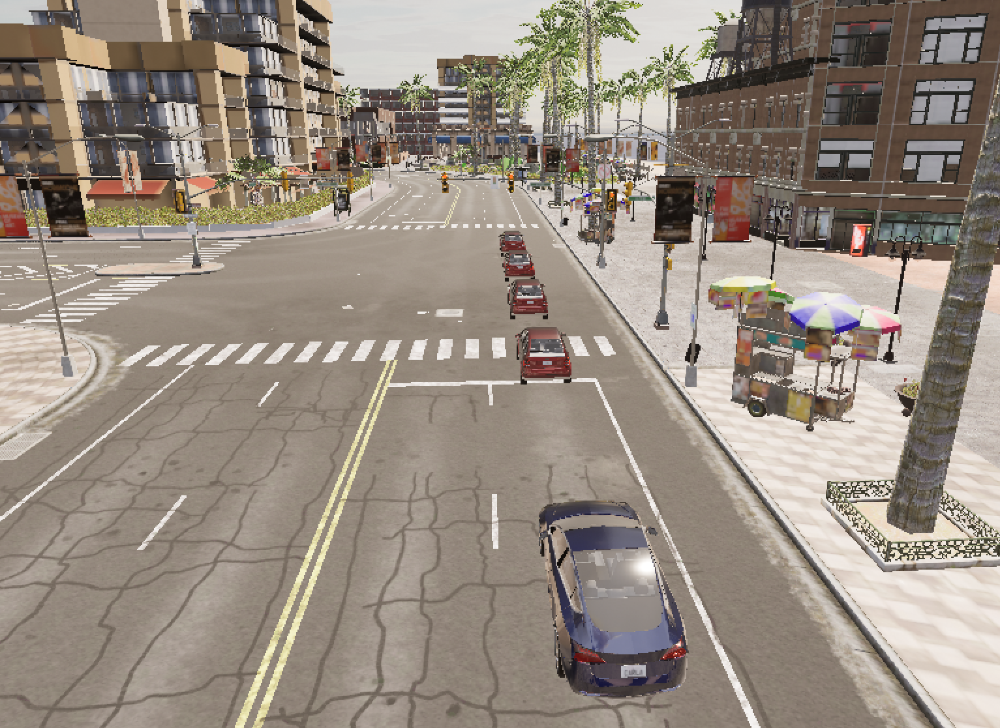
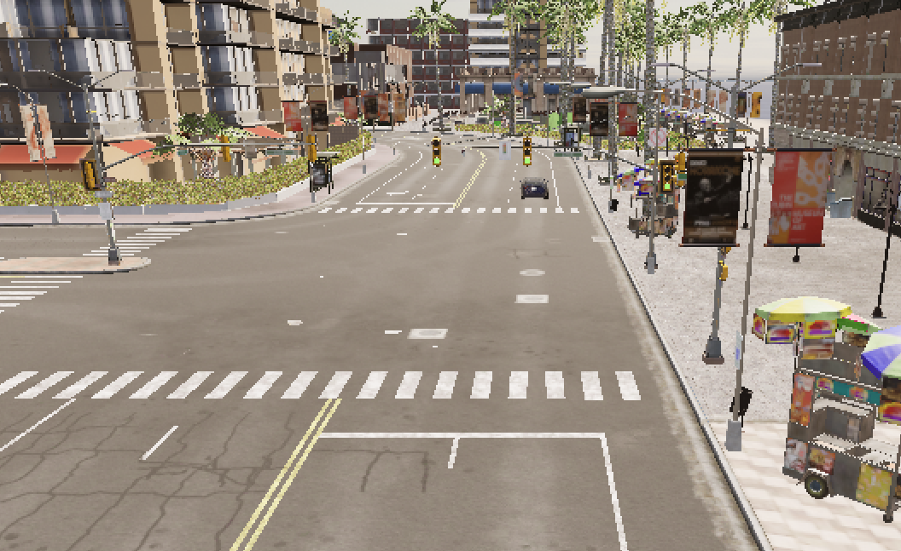
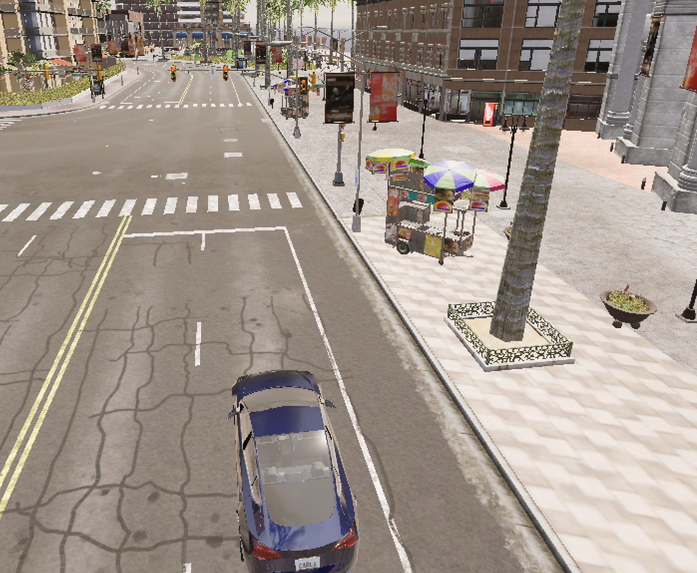
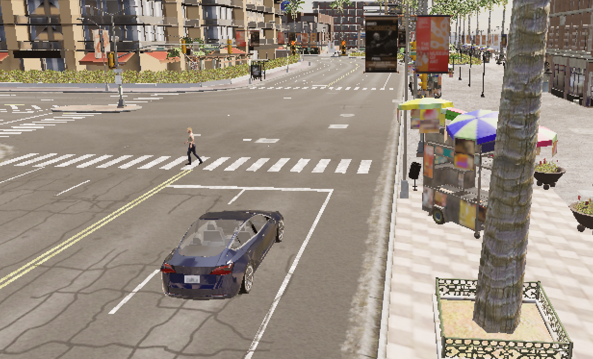

# 自动驾驶多场景行为仿真系统设计与实现

---

# 目录
1. [项目摘要](#1-项目摘要)
2. [项目背景与意义](#2-项目背景与意义)
3. [相关技术与运行环境](#3-相关技术与运行环境)
4. [总体设计与功能架构](#4-总体设计与功能架构)
5. [各场景详细设计](#5-各场景详细设计)
6. [核心代码模块说明](#6-核心代码模块说明)
7. [实验测试与结果展示](#7-实验测试与结果展示)
8. [问题分析与优化方案](#8-问题分析与优化方案)
9. [项目总结与心得体会](#9-项目总结与心得体会)
10. [参考文献](#10-参考文献)

---

## 1. 项目摘要
本项目基于 **CARLA 自动驾驶仿真平台**，结合 Python 语言开发一套多场景自动驾驶行为仿真系统。项目模拟城市道路中**车辆拥堵、行人避让、红绿灯通行、路口穿越、闯红灯、前车突发倒车**等6类典型交通场景，实现车辆环境感知、距离检测、速度控制、紧急制动等自动驾驶基础行为。

系统通过坐标计算、距离判别、状态判断等逻辑完成车辆决策控制，还原真实道路风险场景与合规驾驶行为，可用于自动驾驶行为测试、交通风险模拟与智能驾驶算法入门验证。项目代码结构清晰，场景独立可切换，运行稳定，完成预设全部仿真目标。

**关键词**：CARLA；自动驾驶仿真；场景模拟；车辆控制；紧急制动

---

## 2. 项目背景与意义
### 2.1 项目背景
随着自动驾驶技术快速发展，虚拟仿真测试已成为实车测试的重要补充。CARLA 作为开源自动驾驶仿真平台，支持交通参与者、道路、信号灯、天气等全要素模拟，能够低成本、高安全地复现各类危险交通场景，避免实车测试的安全风险与场地限制。

城市道路工况复杂，车辆拥堵、行人横穿、信号灯路口、无信号路口、前车突发倒车等都是高频风险场景，也是自动驾驶系统必须应对的核心工况。

### 2.2 项目意义
1. **学习实践**：掌握 CARLA 仿真平台使用、Python 实时逻辑编程、空间距离计算与状态控制。
2. **工程应用**：实现多场景模块化开发，具备场景扩展、独立运行、统一入口管理能力。
3. **仿真价值**：模拟合规驾驶与违规驾驶两类行为，对比展示自动驾驶安全决策逻辑。
4. **课程结合**：结合人工智能、智能感知、决策控制等课程知识点，完成理论到实践的落地。

---

## 3. 相关技术与运行环境
### 3.1 核心技术栈
- 编程语言：**Python 3.8**
- 仿真平台：**CARLA 0.9.x**（开源自动驾驶仿真器）
- 核心技术：三维坐标运算、距离检测、车辆状态控制、时序逻辑判断、多角色管理

### 3.2 运行环境
- 操作系统：Windows 11
- 依赖库：carla 官方 Python API、time、math 标准库
- 运行流程：先启动 CARLA 模拟器 → 再运行 Python 主程序 → 选择场景编号执行仿真

### 3.3 CARLA 平台简介
CARLA 是专为自动驾驶研究打造的开源仿真环境，提供完整城市道路、交通参与者（车辆、行人）、交通信号灯、视角控制等功能，支持通过 Python API 对所有仿真对象进行读取、控制与状态监测。

---

## 4. 总体设计与功能架构
### 4.1 整体架构
本项目采用 **主入口 + 独立场景文件** 的模块化设计：
1. **main.py 主入口文件**：统一场景选择、调用对应场景脚本。
2. **run_scenario_0 ~ run_scenario_5**：6个独立场景脚本，各司其职、互不干扰。
3. **公共逻辑**：仿真环境初始化、角色清空、视角设置、车辆生成、运动控制。

### 4.2 整体功能列表
| 场景编号 | 场景名称 | 核心功能 |
| ---- | ---- | ---- |
| 场景0 | 动态车辆超车碰撞 | 模拟道路车辆超车、近距离交会工况 |
| 场景1 | 行人礼让场景 | 区分前方/侧方/后方行人，实现停车、减速、正常通行 |
| 场景2 | 多车拥堵+前车倒车（升级） | 车队拥堵行驶，前车突发倒车，主车紧急制动避障 |
| 场景3 | 车辆闯红灯 | 模拟违规驾驶，无视红灯正常通过路口 |
| 场景4 | 信号灯交叉口通行 | 识别红绿灯状态，红灯停车、绿灯正常行驶 |
| 场景5 | 无信号灯路口穿越 | 接近路口自动减速，模拟谨慎观察通行 |

### 4.3 工作流程
1. 初始化 CARLA 客户端与世界，清空历史车辆、行人。
2. 生成主车与场景所需障碍物、行人、信号灯。
3. 循环读取车辆位置、速度、周边目标距离、信号灯状态。
4. 根据规则输出油门、刹车、转向指令，控制车辆行为。
5. 键盘中断，销毁所有仿真角色，退出场景。

---

## 5. 各场景详细设计
### 5.1 场景0：动态车辆超车碰撞
- 场景描述：道路存在同向行驶车辆，主车执行超车动作，模拟近距离交会风险。
- 控制逻辑：主车保持匀速前进，与前车距离较近时形成交会效果。
- 实现要点：多车辆同步运动、相对位置保持。

### 5.2 场景1：行人礼让场景
- 场景描述：道路出现横穿行人，分三种位置工况。
- 控制逻辑：
  - 前方行人：车辆完全停车礼让；
  - 侧方行人：车辆减速慢行；
  - 后方行人：车辆正常行驶不干预。
- 实现要点：行人位置判断、方位区分、分级减速控制。

### 5.3 场景2：多车拥堵 + 前车突发倒车（重点升级场景）
- 场景描述：前方形成排队拥堵车队，行驶一段时间后中间车辆突然倒车，制造近距离危险工况。
- 控制逻辑：
  1. 主车正常向前行驶；
  2. 3秒后前方车辆挂倒挡低速后退；
  3. 实时计算两车距离，距离小于安全阈值时**紧急全制动**。
- 解决难点：关闭物理异常判定、稳定倒车、车辆不消失、不飞散。

### 5.4 场景3：车辆闯红灯
- 场景描述：路口信号灯为红灯，车辆不执行停车操作，直接通过路口。
- 控制逻辑：全程保持油门输出，无视信号灯状态，模拟违规驾驶行为。

### 5.5 场景4：信号灯交叉口通行
- 场景描述：路口红绿灯自动循环切换（红/黄/绿），车辆识别灯态并做出响应。
- 控制逻辑：
  1. 配置红绿灯时长，解除冻结实现自动切换；
  2. 距离路口较近且红灯亮起时，车辆停车等待；
  3. 绿灯亮起后恢复正常行驶。

### 5.6 场景5：无信号灯路口穿越
- 场景描述：路口无交通信号灯，按照交通规则减速观察通过。
- 控制逻辑：通过坐标判断路口区域，进入范围后自动降低油门、轻踩刹车减速通行。

---

## 6. 核心代码模块说明
### 6.1 公共基础模块（所有场景通用）
1. **CARLA 连接与环境清空**
建立客户端连接，遍历并销毁上一轮残留车辆、行人，保证每次场景启动环境干净。
```python
client = carla.Client('localhost', 2000)
world = client.get_world()
# 清空旧角色
for actor in world.get_actors().filter('*'):
    if actor.type_id.startswith('vehicle'):
        actor.destroy()
```

2. **车辆生成与视角设置**
读取地图生成点，生成主车与障碍车，固定第三方观测视角，方便录制与观察效果。

3. **车辆运动控制类**
使用 `carla.VehicleControl()` 设置 `throttle`（油门）、`brake`（刹车）、`steer`（转向）实现车辆加减速。

### 6.2 核心算法模块
1. **三维距离计算**
通过欧式距离判断主车与障碍物/行人/路口的远近，是所有决策的基础：
```python
dist = math.sqrt(dx**2 + dy**2)
```
2. **方向判断**
向量点积判断目标是否在车辆**正前方**，避免误判侧方、后方物体。
3. **时序触发逻辑**
使用 `time.time()` 计时，实现“运行3秒后开始倒车”等延时动作。

### 6.3 主入口模块（main.py）
提供文本菜单，输入编号调用对应场景脚本，统一项目入口，便于使用与演示。

---

## 7. 实验测试与结果展示
### 7.1 测试环境
- 仿真平台：CARLA 0.9.13
- 运行脚本：Python 3.8
- 测试地图：Town10HD

### 7.2 整体测试结论
所有6个场景均可独立正常启动、稳定运行，无崩溃、无闪退，角色无异常消失、飞散。各场景行为完全符合设计预期：
1. 拥堵场景：前车稳定倒车，主车及时紧急制动，成功避障；
2. 行人场景：按方位分级礼让，行为区分明显；
3. 红绿灯场景：信号灯自动切换，红灯停车、绿灯通行；
4. 闯红灯场景：持续行驶，体现违规行为；
5. 无信号路口：自动减速，符合安全通行规则。

### 7.3 分场景结果展示
> Markdown 插入图片语法：``

#### 图1 场景2 多车拥堵+前车倒车+主车紧急制动

**现象描述**：前方车队静止排队，计时结束后前车平稳倒车，主车检测距离缩短后立刻刹停，未发生碰撞。

#### 图2 场景4 红绿灯路口通行

**现象描述**：信号灯自动红绿切换，红灯阶段车辆停车等待，绿灯正常起步行驶。

#### 图3 场景5 无信号灯路口减速

**现象描述**：车辆接近路口区域自动减速，低速通过路口。

#### 图4 场景1 行人礼让

**现象描述**：前方行人出现，车辆停车；侧方行人出现，车辆减速。

---

## 8. 问题分析与优化方案
### 8.1 开发中遇到的问题
1. **CARLA 连接超时**
   原因：先运行代码、后启动模拟器。
   解决：固定流程 → 先打开 CarlaUE4.exe，再执行 Python 脚本。

2. **车辆设置位置后消失/飞天**
   原因：直接强制修改坐标触发 CARLA 物理异常检测。
   解决：放弃坐标硬改，使用**原生车辆挡位+油门**控制倒车，并关闭碰撞检测。

3. **红绿灯静止不切换**
   原因：信号灯默认被冻结状态。
   解决：调用 `tl.freeze(False)` 解除冻结，并配置红绿黄时长。

4. **路口判断失效，车辆不减速**
   原因：固定坐标判断，车辆无法到达指定点位。
   解决：改为**动态距离判定路口区域**，适配车辆行驶路线。

### 8.2 项目优化方向
1. 增加速度、距离、灯态屏幕文字可视化，直观展示车辆状态。
2. 为无信号路口增加横向来车，丰富交互场景。
3. 引入简单规则分类器，区分正常/危险工况，结合机器学习基础知识点。
4. 增加自动化连续测试功能，自动遍历全部场景。

---

## 9. 项目总结与心得体会
### 9.1 项目总结
本项目完成了基于 CARLA 平台的 **6大类城市自动驾驶典型场景仿真**，实现车辆感知、决策、控制全流程模拟。系统采用模块化设计，代码易读、易维护、易扩展，完整实现拥堵、行人、红绿灯、路口、违规驾驶、紧急避障等功能。

项目充分利用空间几何计算、时序逻辑、状态机控制等知识，将编程与智能驾驶应用结合，达到课程项目设计要求。

### 9.2 心得体会
通过本次机器学习/人工智能期末项目，我系统学习了自动驾驶仿真平台的使用，理解了虚拟仿真在智能驾驶测试中的重要作用。在开发过程中，不断解决车辆控制、物理异常、逻辑判断等问题，提升了 Python 实时程序开发、调试与问题排查能力。

同时，我也认识到自动驾驶是**感知+决策+控制**的综合系统，简单的距离、状态判断即可实现基础智能行为，这也让我对机器学习、智能决策算法有了更直观的理解。本次项目不仅巩固了课堂知识，也为后续学习智能驾驶、机器视觉等方向打下实践基础。

---

## 10. 参考文献
[1] CARLA 官方文档. CARLA: An Open Urban Driving Simulator.
[2] 智能车辆原理与应用. 高校人工智能相关教材
[3] Python 编程：从入门到实践
[4] 自动驾驶仿真测试技术综述

---

