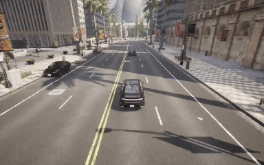
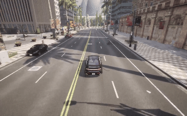

# CARLA 模拟器中的物体与碰撞检测系统 (CARLA ADAS Simulation)
## 一、项目简介
本项目基于 **CARLA 自动驾驶模拟器** 开发，结合计算机视觉与控制理论，实现了一套包含感知、规划与控制的自动驾驶辅助系统（ADAS）。系统利用单目摄像头和YOLOv8进行实时目标检测与测距，实现了车辆定速巡航、自适应跟车（ACC）、自动变道避让（ALC）以及针对横穿马路行人的自动紧急制动（AEB）等核心高级驾驶辅助功能。

## 二、核心功能特性
结合项目的开发历程，本项目已实现以下核心功能：

1. **基础定速巡航**：车辆能够根据设定的目标速度，通过底层 PI 控制器平滑控制油门和刹车，保持稳定行驶。
2. **碰撞检测与预警**：集成 CARLA 物理碰撞传感器，实时捕捉并输出碰撞物类型及冲量数据，为系统提供底线的安全记录。
3. **前向碰撞预警与紧急制动 (FCW & AEB)**：通过视觉雷达实时测算前方障碍物距离。当距离小于安全制动阈值时，自动切断油门并全量输出刹车。
4. **自动变道避障 (ALC - Automated Lane Change)**：检测到前方存在慢速车辆或静止障碍物且存在变道空间时，系统会自动规划并执行向左或向右的安全变道，并在完成避让后自动恢复原定巡航速度。
5. **自适应巡航控制 (ACC - Adaptive Cruise Control)**：当检测到前方有车辆且不满足变道条件时，系统会过滤视觉检测的抖动，平滑地调整自身车速以“咬住”前车，保持动态安全车距。
6. **VRU 弱势道路使用者保护 (横穿行人检测制动)**：针对行人目标，系统会结合连续多帧的横向像素位移，精准预判行人横穿马路的意图，并提前触发强制急刹锁死机制。

## 三、系统架构与模块设计

系统采用模块化设计，主要分为四大核心模块：

### 1. `vision_module.py` (视觉感知模块)
* **模型**：集成 `YOLOv8` 轻量级模型 (`yolov8n.pt`) 进行实时目标检测。
* **测距原理**：利用单目相机的焦距和目标的真实物理高度（车辆1.5m，行人1.7m），结合图像中 Bounding Box 的像素高度估算绝对距离。
* **动态 ROI（感兴趣区域）**：根据目标在画面中的位置和远近，动态划分 ACC 车道保持区域与 AEB 宽幅检测区域，减少误报。

### 2. `planner.py` (局部规划与横向控制模块)
* **车道保持 (LKA)**：通过计算当前位置与前方路点的航向角偏差，使用 PID 算法输出平滑的方向盘转向控制量。
* **自动变道逻辑**：当满足触发距离（35m内）且非跟随状态时，判断左右车道的合法性，选择最优避让方向，重置误差积分，实现平稳切线。

### 3. `acc_module.py` (自适应巡航控制模块)
* **时距控制**：基于安全时距（`headway_time`）和最小缓冲距离（`safe_buffer`）计算理想跟车距离。
* **极致滤波**：针对视觉检测框闪烁带来的“假速度”问题，采用 98% 历史权重 + 2% 当前帧权重的极强低通滤波，确保目标车速计算的平滑性，防止底层控制器“发癫”。

### 4. `aeb_module.py` (自动紧急制动模块)
* **行人横穿预测**：维护一个时间与像素 X 坐标的历史队列。当积攒3帧数据发现行人横向移动速度（`pixel_speed`）极快，且距离小于10米时，瞬间触发 AEB。
* **安全抱死机制**：一旦触发针对行人的急刹，强制抱死车辆 4.0 秒，确保车辆彻底停稳，避免由于行人短暂离开视野导致的“溜车”二次碰撞。

### 5. `main.py` (主控引擎)
* 负责 CARLA 环境的初始化、无路口纯直道生成点的寻找、主车与测试靶标（车辆/行人）的生成。
* 提供基于 `PyGame` 的实时数据仪表盘，展示当前车速、设定巡航速度、档位及底层控制输出（油门/刹车状态）。

## 四、运行环境与依赖

* **仿真器**: CARLA Simulator (版本: 0.9.15)
* **编程语言**: Python 3.10
* **核心依赖库**:
    ```
    pip install carla pygame opencv-python ultralytics numpy keyboard
    ```

## 五、使用说明

1. 启动 CARLA 模拟器服务器 (`CarlaUE4.exe` 或 `./CarlaUE4.sh`)。
2. 运行主程序：
    ```
    python main.py
    ```
3. **交互式配置**：
    * 在终端根据提示输入 `1` 生成测试车辆，或输入 `2` 生成横穿马路的测试行人。
    * 根据提示选择障碍物生成在左侧还是右侧车道。
4. **快捷键操作面板**：
    * `W` : 增加巡航目标车速 (+5 km/h)
    * `S` : 降低巡航目标车速 (-5 km/h)
    * `Q` : 切换前进 [D] / 倒车 [R] 档位
    * `Space` : 手动紧急制动 (手刹)
    * `ESC` : 退出测试程序

## 六、运行效果展示

### 6.1 车辆自动定速驾驶
* **对应功能**：主车在无障碍物的超长直道上运行。通过纵向 PI 控制器自动调整油门输出，实现从 0 加速并稳定保持在用户通过快捷键（W/S）设定的巡航目标车速。
* **效果演示**：


### 6.2 碰撞传感器挂载与物理碰撞监听
* **对应功能**：挂载 `sensor.other.collision` 传感器。当主车主动撞击前车或撞击行人时，黑色的终端控制台能瞬间捕捉触发，并以红色高亮文本实时输出撞击对象的具体类别、具体空间物理坐标以及撞击冲量。
* **效果演示**：


### 6.3 检测到前方物体后自动刹车避免碰撞
* **对应功能**：基础前向碰撞预警（FCW）与自动紧急制动（AEB）。当主车正前方突现静止靶标车，且当前车道由于双黄线或边界限制无法变道时，系统计算刹车距离并在临界点全量输出刹车（`brake = 1.0`）平稳停下。
* **效果演示**：


### 6.4 检测到前方车/人时自动变道避让
* **对应功能**：自动车道变换（ALC）。当主车以高巡航速度行驶时，若前方 35 米内检测到静止障碍车辆，规划器启动。检测到左侧/右侧车道线允许变道且无逆行风险时，系统自动打方向盘切入旁车道执行避让。
* **效果演示**：


### 6.5 向右避让与避让后自动恢复避让前速度
* **对应功能**：ALC 状态机与速度管理闭环。主车检测到左侧有障碍物，优先触发【向右】变道。在变道执行过程中，车速被强制限制在安全慢行速度（15 km/h）。当主车彻底切入右侧车道、航向角完成对齐并恢复平稳居中后，系统自动恢复到变道前设定的高巡航速度。
* **效果演示**：


### 6.6 检测到前方车辆后减速自动跟车
* **对应功能**：自适应巡航控制（ACC）。当前方车辆同样在行驶，或主车判断由于车道限制无法变道避让时，系统放弃变道，老老实实执行跟车。通过 98% 历史权重的低通滤波器消除了视觉框的异常抖动，直接咬住前车速度。当车距误差在 $\pm 5$ 米内时触发死区逻辑，消除微小颠簸，实现舒适的跟车。
* **效果演示**：


### 6.7 检测到行人横穿马路时自动刹车避免碰撞
* **对应功能**：弱势道路使用者保护（VRU-AEB）。当测试场景切换为行人横穿马路时，AEB 控制器通过连续 3 帧的像素横向位移变化计算行人的瞬时移动速度趋势。一旦判定行人正极速向车道中央横穿且距离小于 10 米，瞬间触发强力刹车。同时启动抱死机制，强行锁死刹车 4.0 秒，直到车辆及行人彻底安全。
* **效果演示**：


## 七、开发历程与版本演进

本项目通过标准的 Git 工作流进行迭代开发，主要功能特性已全部合入主分支：

* ✅ **[Merged]** `#7255`: 实现检测到行人横穿马路时自动刹车避免碰撞的功能 *(AEB 横穿预测)*
* ✅ **[Merged]** `#7148`: 实现检测到前方车辆后减速自动跟车功能 *(ACC 自适应跟车)*
* ✅ **[Merged]** `#7118`: 新增向右避让与避让后自动恢复避让前速度的功能 *(ALC 速度恢复机制)*
* ✅ **[Merged]** `#5874`: 新增检测到前方车/人时自动变道避让避免碰撞 *(规划器动态变道)*
* ✅ **[Merged]** `#5829`: 实现检测到前方物体后自动刹车避免碰撞的功能 *(基础 FCW/AEB)*
* ✅ **[Merged]** `#5763`: 实现碰撞传感器并测试碰撞行人与车辆 *(CARLA 物理碰撞监听)*
* ✅ **[Merged]** `#5700`: 实现车辆自动定速驾驶 *(底层 PI 纵向控制)*
