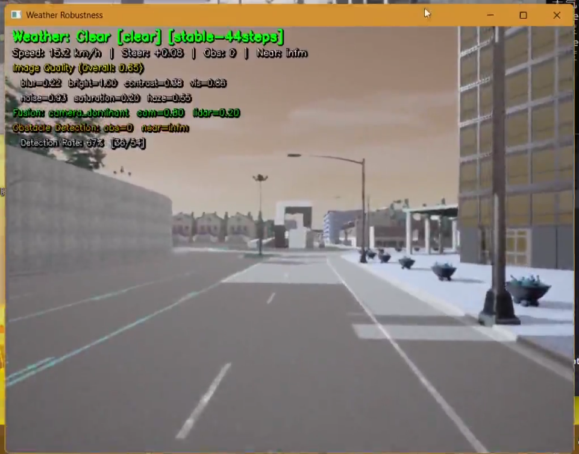
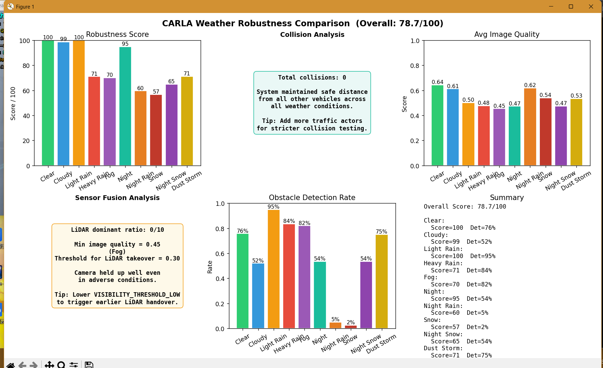
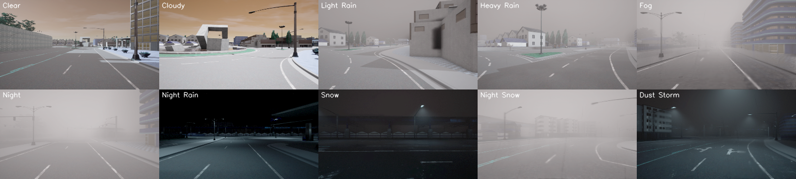

# CARLA 天气鲁棒性测试系统

## 项目简介

在 CARLA 模拟器中测试自动驾驶车辆在 10 种天气条件下的感知鲁棒性，评估图像质量、传感器融合、障碍物检测和碰撞安全的综合表现。



## 系统模块组成

| 模块 | 类名 | 职责 |
|------|------|------|
| 道路循迹控制 | `RoadFollowController` | 沿道路中心线行驶，Waypoint API |
| 图像质量评估 | `ImageQualityAssessor` | 7 维图像质量分解 |
| 自适应融合 | `AdaptiveFusionPerceiver` | 图像+LiDAR 动态融合 |
| DBSCAN 障碍物检测 | `LidarAdaptivePerceiver` | LiDAR 点云聚类检测 |
| 天气渐变过渡 | `WeatherSimulator._update_weather_transition` | 天气平滑切换 |
| 鲁棒性评分 | `RobustnessScorer` | 综合评分输出 |

## 核心功能

### 1. 道路循迹控制

```python
# 旧代码：使用 Carla 内置 Autopilot
vehicle.set_autopilot(True)  # 不可控
```

```python
# 新代码：自定义道路循迹控制器
class RoadFollowController:
    def __init__(self, world, vehicle):
        self._map = world.get_map()
    
    def get_control(self):
        waypoint = self._map.get_waypoint(self._vehicle.get_location())
        # 计算目标方向，PID 控制转向
        ...
```

原代码使用 Carla 内置 Autopilot，无法精确控制。修改后使用 Waypoint API 沿道路中心线行驶，配合 PID 控制转向，保持 30 km/h 匀速。

### 2. 7 维图像质量评估

| 维度 | 含义 | 权重 |
|------|------|------|
| 亮度 | 平均亮度 (0-1) | 15% |
| 对比度 | 像素标准差 | 15% |
| 清晰度 | Laplacian 方差 | 20% |
| 噪声 | 高频噪声水平 | 10% |
| 色彩饱和度 | 平均饱和度 | 10% |
| 可见度 | 远景可见性 | 15% |
| 结构相似度 | 与晴朗天气对比 | 15% |

```python
# 旧代码：单一质量分数
quality = assess_image(image)  # 只输出一个值
```

```python
# 新代码：7 维分解
class ImageQualityAssessor:
    def assess(self, image):
        return {
            "brightness": ...,
            "contrast": ...,
            "sharpness": ...,
            "noise": ...,
            "saturation": ...,
            "visibility": ...,
            "ssim": ...
        }
```

原代码只输出单一质量分数，无法定位性能瓶颈。修改后分解为 7 个维度，精确定位恶劣天气对图像质量的具体影响。

### 3. DBSCAN 聚类障碍物检测

```python
# 旧代码：简单距离阈值
obstacles = [p for p in points if p.distance < threshold]  # 不准确
```

```python
# 新代码：先过滤地面点，再 DBSCAN 聚类
class LidarAdaptivePerceiver:
    def process_point_cloud(self, points):
        # 1. 过滤地面点 (z < -1.8m)
        non_ground = [p for p in points if p.z > -1.8]
        # 2. 只取前方 30m 范围
        front_points = [p for p in non_ground if 0 < p.x < 30 and abs(p.y) < 10]
        # 3. DBSCAN 聚类
        clustering = DBSCAN(eps=1.5, min_samples=5).fit(front_points)
        # 4. 提取障碍物
        obstacles = []
        for cluster_id in set(clustering.labels_):
            if cluster_id == -1: continue  # 跳过噪声
            cluster_points = front_points[clustering.labels_ == cluster_id]
            obstacles.append(cluster_points)
```

原代码用简单距离阈值过滤，无法区分分散的小障碍物和聚集的大障碍物。修改后先用 DBSCAN 聚类，再提取每个簇的边界框，检测更精确。

### 4. 自适应传感器融合

```python
# 旧代码：固定权重融合
weight = 0.5  # 固定
fusion = weight * camera + (1 - weight) * lidar
```

```python
# 新代码：根据图像质量动态调整
class AdaptiveFusionPerceiver:
    def update_weights(self, img_quality):
        if img_quality < 0.3:       # 图像质量极差
            self.camera_weight = 0.2
            self.lidar_weight = 0.8  # 重度依赖 LiDAR
        elif img_quality < 0.6:      # 图像质量一般
            self.camera_weight = 0.5
            self.lidar_weight = 0.5  # 均衡
        else:                        # 图像质量好
            self.camera_weight = 0.7
            self.lidar_weight = 0.3  # 主要依赖相机
```

原代码使用固定权重，恶劣天气下相机失效时仍大量依赖相机。修改后根据图像质量动态调整权重，图像差时自动切换到 LiDAR 主导模式。

### 5. 天气渐变过渡

```python
# 旧代码：天气瞬间切换
world.set_weather(weather)  # 突然变化
```

```python
# 新代码：两阶段过渡
class WeatherSimulator:
    def _update_weather_transition(self, target_params):
        # 阶段1：稳定期 (STEPS_PER_WEATHER - TRANSITION_STEPS 步)
        # 阶段2：过渡期 (TRANSITION_STEPS 步) - 线性插值
        if self._is_transitioning:
            t = self._transition_step / WEATHER_TRANSITION_STEPS
            current = lerp(current_params, target_params, t)
            world.set_weather(current)
```

原代码天气瞬间切换，传感器来不及适应。修改后实现稳定期 + 过渡期两阶段，过渡期内天气参数线性插值，模拟真实天气变化。

### 6. 视觉效果缓存

```python
# 旧代码：每帧重新生成雨滴/雪花
raindrops = np.random.rand(500, 2)  # 每帧 O(n)
```

```python
# 新代码：缓存雨滴/雪花/沙尘粒子
class WeatherSimulator:
    def _add_rain_effect(self, image):
        if self._rain_cache is None or self._rain_seed != seed:
            self._rain_cache = generate_raindrops(seed)
        # 每帧只偏移位置，不重新生成
```

原代码每帧都重新随机生成雨滴和雪花，CPU 开销大。修改后引入缓存机制，仅在随机种子或尺寸变化时重建，大幅降低每帧计算量。

## 碰撞检测与评分体系

```python
# 旧代码：简单碰撞计数
collisions += 1  # 只看有没有碰撞
```

```python
# 新代码：综合评分
class RobustnessScorer:
    def compute_robustness_score(self, records):
        collision_rate = collisions / total_frames
        collision_score = 40 * (1 - collision_rate * 5)  # 碰撞安全 (40分)
        image_score = 30 * avg_img_quality               # 图像质量 (30分)
        
        if avg_img_quality < 0.3:  # 恶劣天气
            fusion_score = 30 * lidar_ratio               # 自适应融合 (30分)
        else:
            fusion_score = 30 * (1 - lidar_ratio)         # 正常天气依赖相机
        
        detect_score = 20 * detection_rate                # 检测率 (20分)
        
        return clip(collision_score + image_score + fusion_score + detect_score, 0, 100)
```

原代码只统计碰撞次数。修改后引入 100 分制综合评分，分四个维度：碰撞安全（40分）、图像质量（30分）、自适应融合（30分）、检测率（20分），并用 `np.clip` 限制在 0-100。

## 多天气对比图表

```python
# 旧代码：只打印文字报告
print(f"Clear: score={s1}, collisions={c1}")
print(f"Rain: score={s2}, collisions={c2}")
```

```python
# 新代码：matplotlib 2×3 子图
def _plot_comparison_chart(self, results):
    fig, axes = plt.subplots(2, 3, figsize=(14, 8))
    # 子图1: 鲁棒性评分柱状图
    # 子图2: 碰撞安全分析
    # 子图3: 平均图像质量柱状图
    # 子图4: 传感器融合分析
    # 子图5: 障碍物检测率柱状图
    # 子图6: 各天气评分汇总
```

原代码只打印文字报告，难以直观对比不同天气的表现。修改后使用 matplotlib 生成 2×3 共 6 张子图的对比图表，一目了然。



# 系统模块组成

| 模块 | 类名 | 职责 |
|------|------|------|
| 道路循迹控制 | `RoadFollowController` | 沿道路中心线行驶，Waypoint API |
| 图像质量评估 | `ImageQualityAssessor` | 7 维图像质量分解 |
| 自适应融合 | `AdaptiveFusionPerceiver` | 图像+LiDAR 动态融合 |
| DBSCAN 障碍物检测 | `LidarAdaptivePerceiver` | LiDAR 点云聚类检测 |
| 天气渐变过渡 | `WeatherSimulator._update_weather_transition` | 天气平滑切换 |
| 鲁棒性评分 | `RobustnessScorer` | 综合评分输出 |

## 天气参数一览

| 天气 | 云量 | 降水量 | 雾浓度 | 风速 | 太阳方位角 | 太阳高度角 |
|------|------|--------|--------|------|-----------|-----------|
| Clear | 10 | 0 | 0 | 10 | 0 | 45 |
| Cloudy | 80 | 0 | 0 | 10 | 0 | 30 |
| Light Rain | 60 | 30 | 0 | 20 | 0 | 20 |
| Heavy Rain | 100 | 80 | 5 | 40 | 0 | 15 |
| Fog | 10 | 0 | 80 | 5 | 0 | 30 |
| Night | 10 | 0 | 0 | 10 | 0 | -80 |
| Night Rain | 60 | 30 | 0 | 20 | 0 | -70 |
| Snow | 90 | 30 | 0 | 15 | 0 | 20 |
| Night Snow | 90 | 30 | 0 | 15 | 0 | -70 |
| Dust Storm | 100 | 0 | 90 | 5 | 20 | 0 |



# 后期计划

- [ ] 添加更多天气类型（如沙尘暴、暴风雪）
- [ ] 支持多车辆并行测试
- [ ] 集成 ROS2 数据流
- [ ] 增加雨天 LiDAR 衰减模拟

