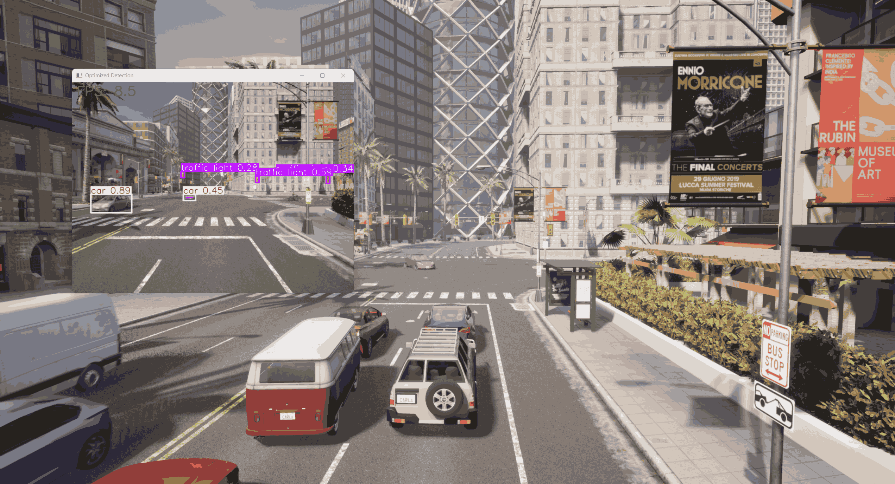
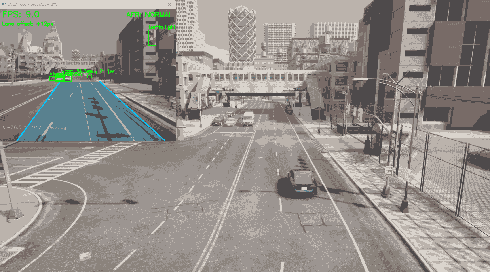

# 自动驾驶感知与控制系统研究 (基于 CARLA)

<p align="center">
  <strong>目标检测 · 深度测距 · 自动制动 · 车道预警 · 多场景仿真</strong>
</p>

<p align="center">
  
  
  
  
</p>

---

## 目录

- [项目简介](#1-项目简介)
- [选题说明](#2-选题说明)
- [开发运行环境](#3-开发运行环境)
- [模块结构与入口](#4-模块结构与入口)
- [运行指南](#5运行指南)
- [第2次提交：实时感知与背景车流系统](#第2次提交-carla_yolo_detection-实时感知与背景车流系统)
- [第3次提交：前向测距与AEB自动紧急制动系统](#第3次提交-前向测距与-aeb-自动紧急制动系统)
- [第4次提交：视觉车道偏离预警系统（LDW）](#第4次提交-视觉车道偏离预警系统-ldw)
- [第5次提交：交通信号灯识别](#第5次提交-交通信号灯识别)
- [第6次提交：多目标持续跟踪](#第6次提交-多目标持续跟踪)
- [第7次提交：驾驶行为评分系统](#第7次提交-驾驶行为评分系统)
- [第8次提交：多天气场景模拟](#第8次提交-多天气场景模拟)
- [第9次提交：数据记录与回放](#第9次提交-数据记录与回放)
- [第10次提交：综合HUD仪表盘整合](#第10次提交-综合-hud-仪表盘整合)
- [按键操作说明](#按键操作说明)
- [参考资料](#参考资料)

---

## 1. 项目简介

本项目旨在通过 Python 脚本与 CARLA 仿真环境进行深度交互，搭建一个基础的自动驾驶测试环境。项目将探索如何利用深度学习视觉算法和虚拟传感器数据，实现对仿真世界中动态物体的检测、环境感知以及基础的车辆控制。

---

## 2. 选题说明

* **参考开源项目:** [kamilkolo22/AutonomousVehicle](https://github.com/kamilkolo22/AutonomousVehicle)
* **重构思路:** 原项目部分模块对 Windows 系统兼容性较差，本项目提取其“视觉识别 + 传感器交互”的核心架构，在 Windows 环境下使用纯 Python 配合 PyTorch 进行完全重构，以确保跨平台的易用性和代码的可读性。
- **参考开源项目：** [kamilkolo22/AutonomousVehicle](https://github.com/kamilkolo22/AutonomousVehicle)
- **重构思路：** 原项目部分模块对 Windows 系统兼容性较差，本项目提取其"视觉识别 + 传感器交互"的核心架构，在 Windows 环境下使用纯 Python 配合 PyTorch 进行完全重构，以确保跨平台的易用性和代码的可读性。

---

## 3. 开发运行环境

* **编程语言:** Python 3.8
* **核心框架:** PyTorch (支持 CUDA 加速), OpenCV
* **开发工具:** Visual Studio Code / Anaconda
| 项目     | 版本/说明                         |
| -------- | --------------------------------- |
| 操作系统 | Windows 10/11                     |
| 仿真平台 | HUTB CARLA_Mujoco_2.2.1           |
| 编程语言 | Python 3.8                        |
| 核心框架 | PyTorch（支持 CUDA 加速）、OpenCV |
| 开发工具 | Visual Studio Code / Anaconda     |

---

## 4. 模块结构与入口

* 本模块的所有核心代码存放于 `src/carla_yolo_detection` 目录下。
* 模块的主程序入口为 `main.py`。
- 本模块的所有核心代码存放于 `src/carla_yolo_detection` 目录下。
- 模块的主程序入口为 `main.py`。

```
nn/
├── docs/carla_yolo_detection/
│   ├── README.md               ← 本文档
│   └── images/                 ← 各阶段运行截图
└── src/carla_yolo_detection/
    ├── main.py                 ← 主程序入口
    └── requirements.txt        ← 依赖清单
```

## 5.运行指南
---

### 步骤 1：启动 CARLA 模拟器
## 5.运行指南

运行 `CarlaUE4.exe`，等待地图加载完毕。

### 步骤 2：配置 Python 环境

> **⚠️ 核心避坑**：本项目基于 HUTB CARLA_Mujoco_2.2.1，必须先手动安装模拟器自带的 `carla` 库，不能直接 pip install carla。
> ⚠️ **核心避坑**：本项目基于 HUTB CARLA_Mujoco_2.2.1，必须先手动安装模拟器自带的 `carla` 库，不能直接 `pip install carla`。

请在 Anaconda 环境（推荐 Python 3.8）中，**依次执行**以下命令：

1. **安装底层 CARLA API** (请将路径替换为你电脑上实际的 `.whl` 路径)：
**1. 安装底层 CARLA API**（请将路径替换为你电脑上实际的 `.whl` 路径）：

```bash
pip install D:\hutb\hutb_car_mujoco_2.2.1\PythonAPI\carla\dist\hutb-2.9.16-cp38-cp38-win_amd64.whl
```

**2. 安装常规依赖库：**

   ```bash
   pip install D:\hutb\hutb_car_mujoco_2.2.1\PythonAPI\carla\dist\hutb-2.9.16-cp38-cp38-win_amd64.whl

   ```
```bash
pip install -r src/carla_yolo_detection/requirements.txt -i https://pypi.tuna.tsinghua.edu.cn/simple
```

2. 安装常规依赖库：
   ```pip install -r src/carla_yolo_detection/requirements.txt -i [https://pypi.tuna.tsinghua.edu.cn/simple](https://pypi.tuna.tsinghua.edu.cn/simple)```
   **3.（可选）开启 GPU 显卡加速：**

如果你拥有 NVIDIA 显卡并希望获得 30+ 的流畅 FPS，请**务必额外执行**此命令覆盖安装 CUDA 版 Torch：

3. **(可选) 开启 GPU 显卡加速**：
   如果你拥有 NVIDIA 显卡并希望获得 30+ 的流畅 FPS，请**务必额外执行**此命令覆盖安装 CUDA 版 Torch：
```bash
pip install torch torchvision torchaudio --index-url https://download.pytorch.org/whl/cu118
```

   ```bash
   pip install torch torchvision torchaudio --index-url [https://download.pytorch.org/whl/cu118](https://download.pytorch.org/whl/cu118)

   ```
### 步骤 3：运行程序

步骤 3：运行程序
请在项目根目录下执行核心脚本：
```python src/carla_yolo_detection/main.py```

# [第2次提交] carla_yolo_detection: 实时感知与背景车流系统
```bash
python src/carla_yolo_detection/main.py
```

## 1. 模块功能
启动后程序会自动清理上次残留 actor，生成自车和背景车流，CARLA 视角自动对准自车位置。按 **Ctrl+C** 退出，程序自动清理所有 actor 并生成驾驶评分报告。

---

## [第2次提交] carla_yolo_detection: 实时感知与背景车流系统

### 1. 模块功能

本模块实现了自动驾驶视觉感知的基础闭环：

- **实时物体检测**: 集成 YOLOv5s 模型，实时识别 CARLA 环境中的车辆与行人。
- **背景交通流生成**: 利用 Traffic Manager 自动随机部署 30 辆背景车，模拟动态路况。
- **异步推理架构**: 优化了图像处理流程，通过回调截取最新帧，避免了深度学习推理导致的画面卡死，并支持实时 FPS 显示。
- **安全监听**: 挂载碰撞传感器 (Collision Sensor)，实时在终端发出碰撞预警。
- **实时物体检测**：集成 YOLOv5s 模型，实时识别 CARLA 环境中的车辆与行人。
- **背景交通流生成**：利用 Traffic Manager 自动随机部署 30 辆背景车，模拟动态路况。
- **异步推理架构**：优化了图像处理流程，通过回调截取最新帧，避免了深度学习推理导致的画面卡死，并支持实时 FPS 显示。
- **安全监听**：挂载碰撞传感器（Collision Sensor），实时在终端发出碰撞预警。

## 2. 运行效果
### 2. 运行效果




---

#  [第3次提交] 前向测距与 AEB 自动紧急制动系统
## [第3次提交] 前向测距与 AEB 自动紧急制动系统

## 1. 功能说明
### 1. 功能说明

在感知系统的基础上，本版本引入了决策与控制模块，实现了车辆的主动安全防护，并大幅优化了仿真体验：

  * **自动垃圾回收**：启动时自动销毁上次运行残留的车辆与传感器，杜绝幽灵碰撞。
  * **视角自动追踪**：初始化时自动将 CARLA 旁观者视角 (Spectator) 锁定至自车上方，告别手动找车的烦恼。
  * **HUD 增强显示**：新增自车实时全局坐标 (X, Y, Yaw) 与 AEB 状态指示灯的屏幕渲染。
- **多传感器同步与测距**：同步挂载 RGB 与 Depth 深度相机（统一 FOV 与 Transform）。利用 YOLO 提取目标框，映射至深度图取中值，实现了极具鲁棒性的抗噪前向测距。
- **三段式接管控制（AEB）**：
  - `距离 > 15m（NORMAL）`：安全状态，车辆交由 Autopilot 自主巡航。
  - `5m < 距离 ≤ 15m（WARN）`：预警状态，终端提示注意前方目标。
  - `距离 ≤ 5m（BRAKE）`：危险状态，系统强行覆盖 Autopilot，油门归零、刹车拉满（`brake=1.0`），画面闪烁红色警报覆层。危险解除后自动恢复 Autopilot。
- **仿真环境深度优化**：
  - **自动垃圾回收**：启动时自动销毁上次运行残留的车辆与传感器，杜绝幽灵碰撞。
  - **视角自动追踪**：初始化时自动将 CARLA 旁观者视角（Spectator）锁定至自车上方，告别手动找车的烦恼。
  - **HUD 增强显示**：新增自车实时全局坐标（X, Y, Yaw）与 AEB 状态指示灯的屏幕渲染。

### 2. 运行效果展示


*图：系统成功捕获前方小于5米的目标，瞬间夺取控制权触发 EMERGENCY BRAKE，并渲染红色全屏警报。*

---

## [第4次提交] 视觉车道偏离预警系统 (LDW)

### 功能说明

在实现纵向控制（AEB）的基础上，本版本引入了横向环境感知，通过纯视觉算法实现了高鲁棒性的车道偏离预警系统（Lane Departure Warning）：

- **图像预处理流水线**：通过灰度化 → 高斯模糊 → Canny 边缘检测 → 梯形 ROI 掩膜，精准滤除天空、对向车道及路外建筑的干扰，聚焦本车道特征。
- **抗锯齿车道线提取**：使用霍夫变换（HoughLinesP）提取线段，结合斜率正负分类，并通过一次多项式回归拟合（$x = f(y)$）重构左右车道线，有效解决透视畸变与垂直斜率崩溃问题。
- **动态偏离计算与低速屏蔽**：实时计算车道中心与画面中心（自车中心）的像素偏移量（Offset）。引入速度动态过滤机制，当车速低于 5.4km/h（多为路口或起步）时自动挂起检测，杜绝复杂路口斑马线的误报。
- **沉浸式 HUD**：
  - `NORMAL`：路面铺设半透明蓝色安全引导区，绘制动态虚线中心线。
  - `WARNING`：偏移量突破阈值（±60px）时，触发双向警报，越界侧车道线高亮变红，并在屏幕中央及左上角弹出醒目的方向纠正提示。

### 运行效果展示



*图：系统提取车道边界，在车辆偏移压线时触发红色警报并提示偏离方向，同时完美兼容原有的 YOLO 车辆检测与 AEB 测距。*

---

## [第5次提交] 交通信号灯识别

### 功能说明

在 YOLO 检测结果基础上，对识别到的 `traffic light` 类别目标进行二次颜色分析，判断当前信号灯状态：

- **颜色分析**：提取检测框内图像，在 HSV 色彩空间中分别计算红色、黄色、绿色像素占比，根据占比最大值判断当前灯色。
- **画面状态提示**：画面右侧常驻信号灯状态图标（🔴 / 🟡 / 🟢），红灯时在屏幕顶部显示 `RED LIGHT` 警告文字。
- **与 AEB 联动**：检测到红灯且车速未归零时，触发预警提示，提醒驾驶员注意信号灯状态。
- **低置信度过滤**：仅对置信度 > 0.5 的信号灯目标进行颜色分析，减少误判。

### 运行效果展示


---

## [第6次提交] 多目标持续跟踪

### 功能说明

基于 **SORT（Simple Online and Realtime Tracking）** 算法，对 YOLO 检测框进行跨帧关联，为每个目标分配唯一持续 ID：

- **卡尔曼滤波**：预测目标下一帧位置，处理短暂遮挡和检测丢失。
- **IOU 匹配**：关联当前帧检测结果与已有轨迹，目标丢失超过 3 帧后自动移除。
- **持续 ID 显示**：检测框上同时显示类别、距离和跟踪 ID（如 `car #3: 8.2m`），不同 ID 使用不同颜色区分。
- **轨迹绘制**：在画面上绘制每个目标最近若干帧的运动轨迹，直观展示目标运动趋势。

### 运行效果展示


---

## [第7次提交] 驾驶行为评分系统

### 功能说明

实时统计驾驶过程中的关键行为指标，程序退出时自动生成 `driving_report.txt`：

| 指标         | 说明                       | 扣分规则    |
| ------------ | -------------------------- | ----------- |
| 碰撞次数     | 碰撞传感器触发次数         | 每次 -20 分 |
| AEB 制动次数 | 触发紧急制动的次数         | 每次 -3 分  |
| LDW 预警次数 | 车道偏离触发次数           | 每次 -3 分  |
| 闯红灯次数   | 红灯状态下车速未归零次数   | 每次 -10 分 |
| 平均速度     | 行驶期间的平均车速（km/h） | 参考项      |

综合评分满分 100 分，实时显示在画面右下角，程序退出时打印完整报告。

### 运行效果展示


---

## [第8次提交] 多天气场景模拟

### 功能说明

支持一键切换四种典型天气环境，验证感知系统在不同条件下的鲁棒性：

| 天气模式 | 快捷键 | 场景特点                             |
| -------- | ------ | ------------------------------------ |
| ☀️ 晴天   | `C`    | 基准环境，感知最佳                   |
| 🌧️ 雨天   | `R`    | 路面反光，能见度下降，LDW 检测受干扰 |
| 🌫️ 雾天   | `F`    | 远距目标丢失，YOLO 置信度整体下降    |
| 🌙 夜间   | `N`    | 暗噪增加，车道线检测依赖路灯亮度     |

天气切换后，YOLO 检测置信度和 LDW 车道线检测质量的变化会直观体现在画面上，可用于对比算法在不同环境下的表现差异。

### 运行效果展示


---

## [第9次提交] 数据记录与回放

### 功能说明

- **黑匣子数据记录**：每帧将车辆状态持续写入 `blackbox.csv`，字段包括：

  ```
  timestamp, x, y, z, speed_kmh, yaw, aeb_state, ldw_state, score
  ```

- **场景录制与回放**：

  | 按键 | 功能                         |
  | ---- | ---------------------------- |
  | `W`  | 开始录制当前场景             |
  | `S`  | 停止录制并保存为 `.log` 文件 |
  | `P`  | 回放最近一次录制             |

  录制文件可在同一地图重现完整驾驶轨迹，便于复盘问题场景、对比不同参数下的驾驶表现。

### 运行效果展示


---

## [第10次提交] 综合 HUD 仪表盘整合

### 功能说明

将前九次迭代的所有功能整合进统一的 HUD 界面，形成完整的驾驶辅助监控系统，所有模块同帧渲染，无额外性能开销：

**整合内容：**

- YOLO 目标检测 + SORT 多目标跟踪 + 深度测距，三者融合显示
- AEB 纵向制动 + LDW 横向预警，双重安全保障
- 交通信号灯识别常驻显示
- 实时驾驶评分右下角常驻
- 天气模式、场景录制快捷键全部可用
- GPU 模式下整体可达 25+ FPS

### 运行效果展示


---

## 按键操作说明

| 按键     | 功能                   | 分类     |
| -------- | ---------------------- | -------- |
| `C`      | 切换为晴天             | 天气控制 |
| `R`      | 切换为雨天             | 天气控制 |
| `F`      | 切换为雾天             | 天气控制 |
| `N`      | 切换为夜间             | 天气控制 |
| `W`      | 开始录制场景           | 录制回放 |
| `S`      | 停止录制并保存         | 录制回放 |
| `P`      | 回放已保存场景         | 录制回放 |
| `Ctrl+C` | 退出程序并生成评分报告 | 系统控制 |

1. HUTB CARLA 仿真平台：[https://github.com/OpenHUTB/carla](https://github.com/OpenHUTB/carla)
2. 参考项目：[kamilkolo22/AutonomousVehicle](https://github.com/kamilkolo22/AutonomousVehicle)
3. YOLOv5 官方仓库：[https://github.com/ultralytics/yolov5](https://github.com/ultralytics/yolov5)
4. CARLA 官方文档：[https://carla.readthedocs.io/](https://carla.readthedocs.io/)
5. SORT 多目标跟踪算法：[https://github.com/abewley/sort](https://github.com/abewley/sort)
6. OpenCV 霍夫变换文档：[https://docs.opencv.org/](https://docs.opencv.org/)